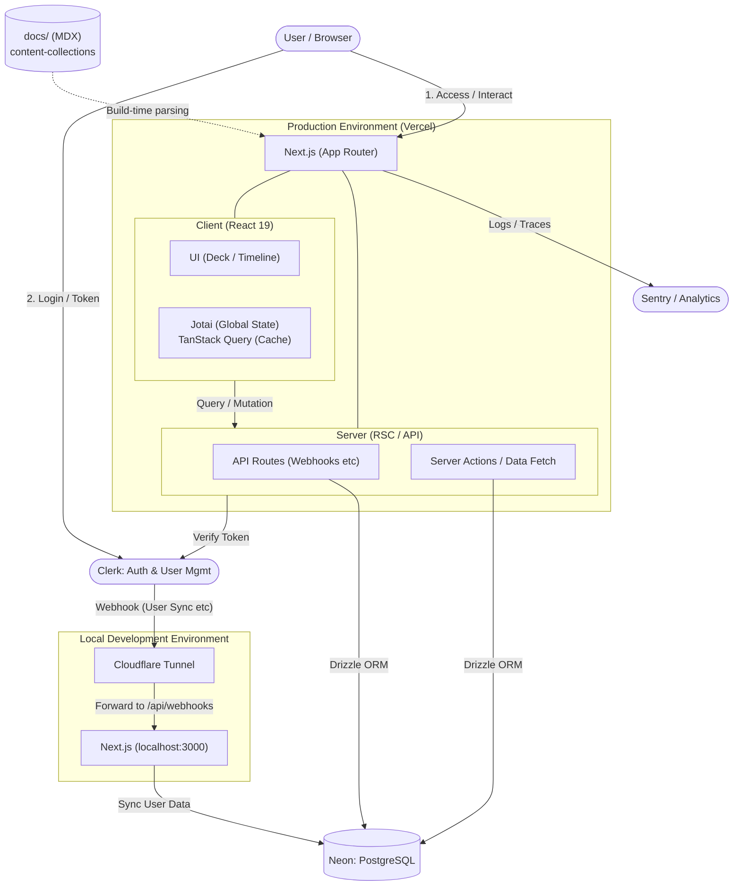

# Mitamatch Operations for Web

ラスバレ向けのWebツール群（Deck Builder / Timeline Builder / ドキュメント）を提供する、Next.jsベースのアプリケーションです。

## プロジェクト概要

主な機能:

- Deck Builder（デッキ作成・保存・共有）
- Timeline Builder（オーダータイムライン作成）
- Docs（MDXベースのドキュメント）
- 認証・ユーザーデータ連携（Clerk + Postgres）

## 構成



## 技術スタック

- Framework: Next.js 16 (App Router), React 19, TypeScript
- UI: MUI, dnd-kit, CodeMirror
- State/Data: Jotai, TanStack Query
- Auth: Clerk
- DB/ORM: Neon(PostgreSQL), Drizzle ORM, drizzle-kit
- Observability: Sentry, OpenTelemetry, Vercel Analytics/Speed Insights
- Content: MDX + content-collections
- Test: Vitest, Testing Library
- Library: fp-ts
- Lint/Format: oxlint, oxfmt, Biome
- Package Manager: pnpm
- Runtime管理: Volta (`node@24.14.0`)

## ディレクトリ構造

```text
.
|- app/                    # App Router のページ/ルートハンドラ
|  |- api/                 # API routes（Webhook等）
|  |- deck-builder/        # Deck Builder画面
|  |- timeline-builder/    # Timeline Builder画面
|  |- docs/                # ドキュメント表示ルート
|  |- dashboard/           # ダッシュボード関連
|- src/
|  |- components/          # UIコンポーネント
|  |- database/            # Drizzle schema/DBアクセス
|  |- domain/              # ドメインデータ(JSON含む)
|  |- parser/              # スキル/クエリパーサ
|  |- evaluate/            # 評価ロジック
|  |- jotai/               # グローバル状態
|  |- styles/, theme/      # スタイル/テーマ
|- docs/                   # MDXドキュメントソース
|- public/                 # 画像アセット
|- drizzle/                # SQLマイグレーション
|- scripts/                # メンテ/seedスクリプト
|- content-collections.ts  # docsコンテンツ定義
|- next.config.ts          # Next/Sentry/MDX設定
|- drizzle.config.ts       # Drizzle設定
```

## セットアップ

### 1. Node.js / pnpm

このプロジェクトはVoltaでNodeバージョンを固定しています。

```bash
volta install node@24.14.0
pnpm install
```

### 2. 環境変数

`.env.example` をもとに `.env` を作成してください。

```bash
cp .env.example .env
```

少なくとも次の値が必要です（用途に応じて）:

- `POSTGRES_URL`
- `POSTGRES_DEVELOP_BRANCH_URL`（開発時）
- `CLERK_WEBHOOK_SECRET` / `CLERK_WEBHOOK_DEV_SECRET`
- `GTM`, `GTAG`
- `SENTRY_AUTH_TOKEN`（Sentry連携時）

Clerkの通常キー（`NEXT_PUBLIC_CLERK_PUBLISHABLE_KEY` / `CLERK_SECRET_KEY`）も利用環境に合わせて設定してください。

## 開発の進め方

### ローカル起動

```bash
pnpm dev
```

### テスト

```bash
pnpm test
pnpm test:coverage
```

### Lint / Format

```bash
pnpm lint
pnpm lint:fix
pnpm fmt
pnpm fmt:check
```

### ビルド確認

```bash
pnpm build
pnpm start
```

## データベース運用

Drizzle設定は `drizzle.config.ts` で管理しています。

- schema: `src/database/schema.ts`
- migration出力: `drizzle/`

初期データ投入:

```bash
pnpm seed
```

`scripts/seed.ts` は `src/domain/memoria/memoria.json` と `src/domain/order/order.json` をDBに投入します。

## ドキュメント運用

- MDXソース: `docs/`
- 変換設定: `content-collections.ts`
- 表示ルート: `app/docs/[...slug]/page.tsx`

## License

MIT License. See [LICENSE](LICENSE).
